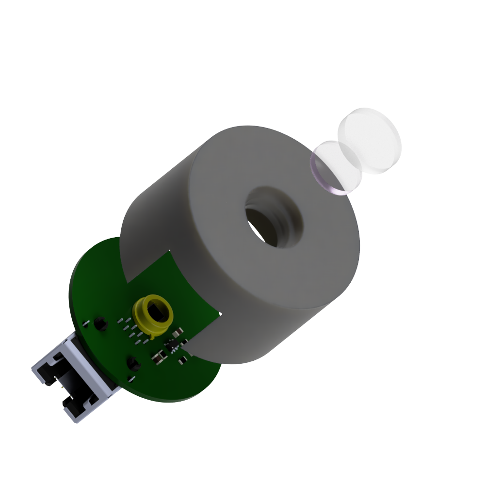
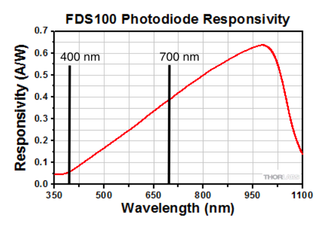
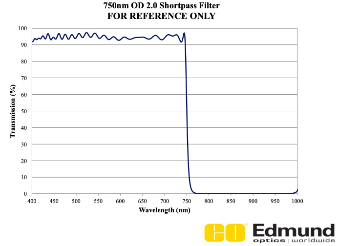

# PARmeter
## Introduction

**P**hotosynthetic **A**ctive **R**adiation (**PAR**) meters are designed to measure light intensity that has a wavelength between ~400 and 700 nm. This range represents the usable range for photosynthesising organims. This information is important for (amongst other things):

1. Studying photosynthesis
2. Calibrating plant growth light fixtures
3. Calibrating aqurarium LED arrays 

Readings are usually represented as the number of moles of photons per meter squared per second (**&mu;E m-2 s-1** or **&mu;mol m-2 s-1**). 

PAR meters differ from **l**uminous fl**ux** (**lux**) meters in that lux meters are typically used to measure wavelengths specific to human vision rather than those avaliable to photosynthesising organisms. Unlike PAR meters, lux meters require different coefficents for different light sources (white light, warm white light, blue, green, cyan etc.); therefore, they need to be calibrated for each light quality used. 

### Photodiode response

PAR meters are quite expensive when compared to lux meters as PAR meters require a virtually flat spectral response between the 400 and 700 nm wavelength range. This spectral response depends upon the photodiode used for detection. Typically, photodiodes have a varied wavelength specific response and as such only a few have ideal characteristics for PAR meters.

  

For this design I am using the [FDS100](https://www.thorlabs.com/thorproduct.cfm?partnumber=FDS100) (Silicon Photodiode) from ThorLabs. As its response is farily linear through the wavelength ranges of PAR. The increase in responsitivity with increasing wavelength is as a result of increasing [photon energy](https://en.wikipedia.org/wiki/Photon_energy).

### Cutoff filter

As can be seen from the photodiode responsitivity figure, the FDS100 photodiode is very responsive in wavelengths greater than 700 nm, therefore it is important that a short-pass filter is used to block these wavelengths from reaching the detector. 

  

Here I am using a 750 nm [short-pass filter](https://www.edmundoptics.com/p/750nm-125mm-dia-od-20-shortpass-filter/43482/) from Edmund optics. 750 nm is greater than the 400 - 700 nm range I mentioned earlier. However, the PAR range that is commonly used was determined a long time ago and there is evidence in the literature that IR-wavlengths are important to photosynthesis. 

